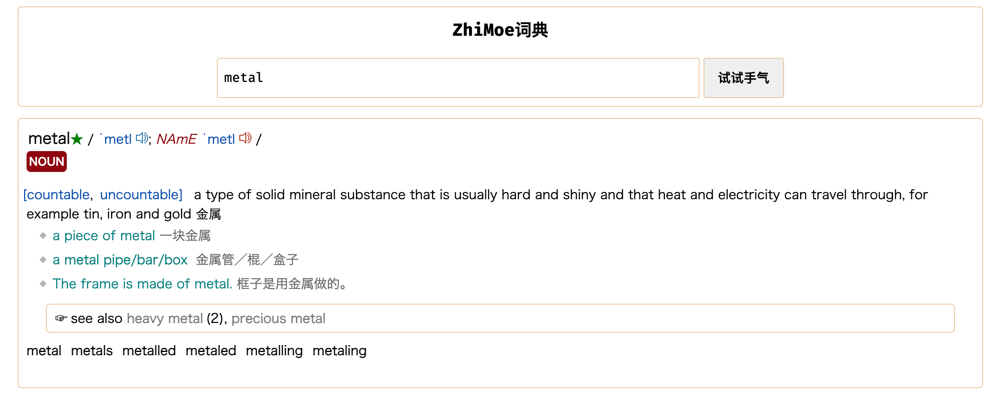

# mdict-rs

A simple web dictionary, built in rust, based on mdx format dictionary file.

It's at an early stage of development. The parser focuses on MDX V2-compatible dictionaries (including newer engine versions), and currently supports encrypted flags 0/1/2/3.

## usage

1. Put your `.mdx` / `.mdd` files into the `mdict/` folder (default), or set `MDX_DICT_DIR` to a directory containing them.
2. (Optional) Add a per-dictionary config TOML next to the `.mdx` file, e.g. `mdict/foo.toml` for `mdict/foo.mdx`.
3. Run with:

```bash
cargo run --release
# now open your chrome, and search
# http://localhost:8181
```

On first run, the server will build SQLite index files (`*.db`) next to the dictionary files for fast lookup.

### Static files

The web UI is served from (in order):
1. `./static/` next to the binary
2. `./static/` in the current working directory
3. `resources/static/` (development)

### Dictionary resource routing

To keep entry links, images and audio separated, the server now exposes:

1. `GET /dict/{id}/entry/{word}` for dictionary entry jumps
2. `GET /dict/{id}/res/{path}` for static resources in dictionary packages
3. `GET /dict/{id}/audio/{path}` for audio resources

Legacy `GET /resource/{id}/{path}` still works for backward compatibility.

## screenshot



## 参考

MDX的解析功能和mdx文件规范参考[mdict-analysis](https://bitbucket.org/xwang/mdict-analysis/src/master/)
和文章[MDX/MDD 文件格式解析](http://einverne.github.io/post/2018/08/mdx-mdd-file-format.html)
